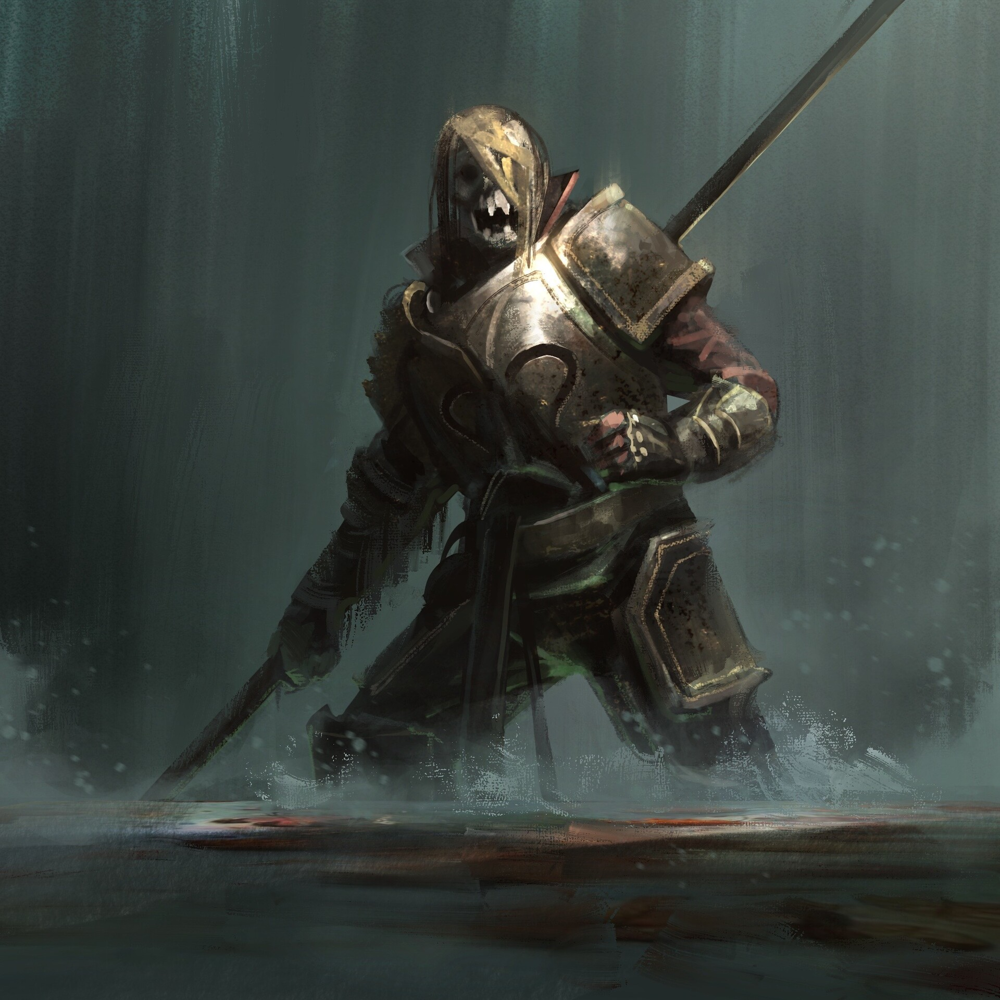
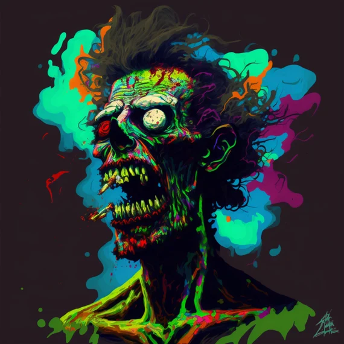

# Project Graveyard
  
**Welcome to the graveyard**

* * *

# Past Projects
**Welcome to the numerous projects I have worked on since 2021/2022.**

* * *

## Completed: Lox Programming Language
  

**Takeaways**

*   Learned how to refactor using feature envy, and primitive obsession with Jetbrains Tooling
*   Learned the importance of writing sufficient number of characterization tests
*   Learned more about programming languages  
[GitHub](https://github.com/CodeItQuick/my-own-programming-language)  

* * *
## Completed: Evercraft Kata - Test-Commit-Revert
  

**Takeaways**

*   Small Steps
*   Frequently adding tests
*   More care in the programming being accomplished  
[GitHub](https://github.com/CodeItQuick/tcr-evercraft-2)   

* * *

## Completed: Boomer Bot
  

**Takeaways**

*   Fun project to bridge the generational gap between zoomers and boomers through accurate translations.  
[GitHub](https://github.com/CodeItQuick/BoomerBot)

* * *

## Completed: Expense Report Kata
  

**Takeaways**

*   Learned Proper Hexagonal Architecture
*   Able to use relatively few acceptance tests to enable refactoring work  
*   Learned how to wrap different elements within a website that have side effects and are traditionally difficult to test    
[GitHub](https://github.com/CodeItQuick/expense-report-kata-ensemble)  

* * *

## In-Progress: Stock Picker
  

**Takeaways**

*   Learning Domain Driven Design and OOP
*   Implementing different kinds of tests  
*   C# and .NET Development  
[GitHub](https://github.com/CodeItQuick/StockApplicationASPNetWebMVCIndividualIdentity)   

